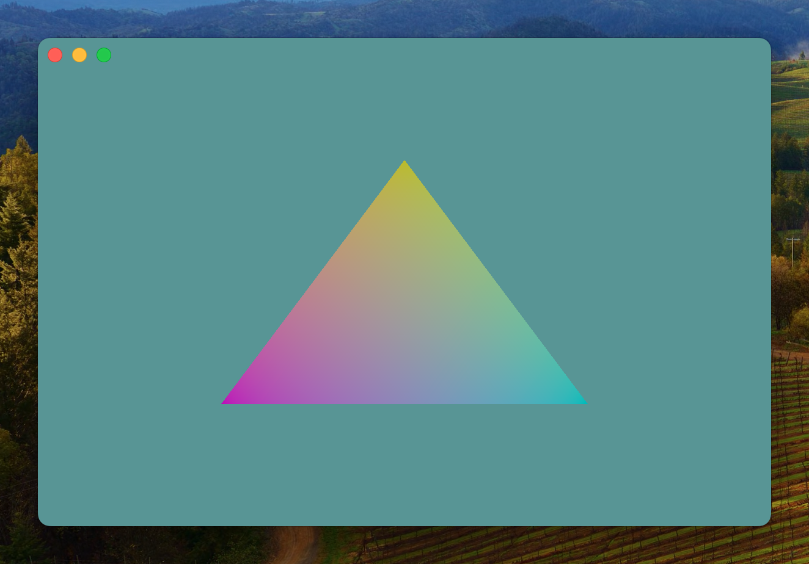
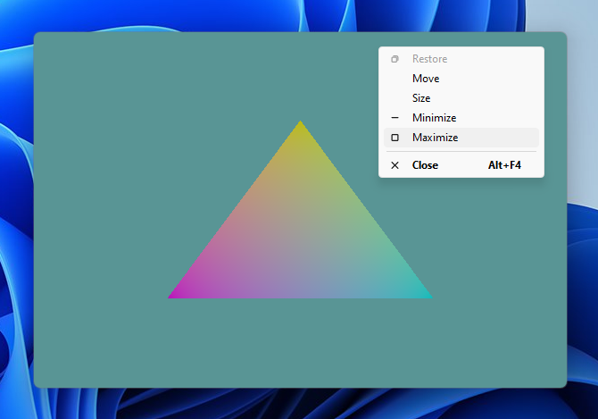
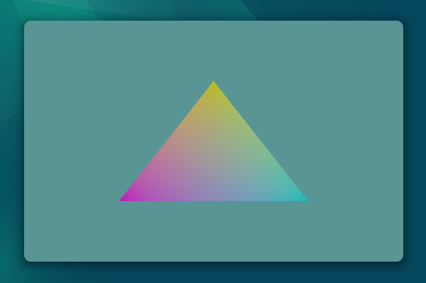

# modeler

A cross-platform (macOS, Windows, Linux) application implementing native, borderless windows and a Vulkan rendering context.

* All window management (creation/resizing/etc.) is handled via native system APIs (AppKit, win32, wayland) rather than a layer like GLFW or SDL
* Legitimate application windows are used, so all behaviors like snapping, tiling, etc. work as expected
* Multi-monitor HiDPI awareness is implemented on all platforms

Functionality is nearly feature-complete. The following major tasks remain:
* Fullscreen mode
	* Attempting to acquire exclusive fullscreen access if possible (VK_EXT_full_screen_exclusive extension)
	* Disabling window border/shadow renderpass on wayland when transitioning to fullscreen
* Apply this framework via a game/application beyond drawing a triangle :)

 
 
 

## Building

`make` builds the binary on Linux (modeler) and Windows (modeler.exe), and a static library (modeler.a) on macOS. The macos application can be built via the Xcode project under `xcode/`.

To enable debugging symbols, external SPIR-V files, and dynamic libraries, set the `DEBUG` environment variable `make DEBUG=true`

## Linux

### Build Dependencies
wayland-protocols
libwayland-dev
libvulkan-dev
glslc
bsdextrautils (hexdump)

#### Debug only
vulkan-validationlayers

## macOS

### Vulkan SDK
Set up locations of Vulkan libraries to which to link: Xcode > Settings > Locations > Custom Paths

| Name			| Display Name		| Path							|
|--			|--			|--							|
| VULKAN_SDK		| Vulkan SDK		| <path_to_vulkan_sdk_including_version>		|
| VULKAN_HEADERS	| Vulkan Headers	| <path_to_vulkan_sdk_including_version>/macOS/include	|
| VULKAN_LIB		| Vulkan Libraries	| <path_to_vulkan_sdk_including_version>/macOS/lib	|

## Windows
Install mingw_w64 (preferrable via msys64).

Install Vulkan SDK. Paths in Makefile may need to be updated for install location and version.
